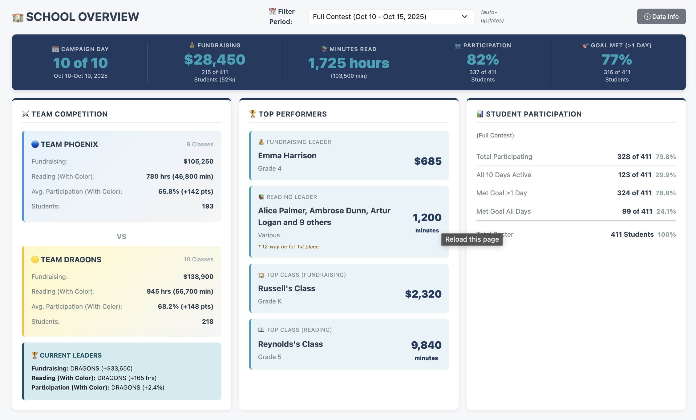

# Read-a-Thon Management System


A complete web-based data analysis and reporting system for managing elementary school read-a-thon events. **Built entirely with [Claude Code](https://claude.ai/code)** - see [how it was built](#-built-with-claude-code) below.

> **⚠️ DATA DEPENDENCY NOTICE**
> This application requires CSV data from **[ReadAThon.com](https://www.read-a-thon.com/)**.
> You must download your school's data from ReadAThon.com to use this system.
> See [Data Source](#-data-source) section below for details.

## 📸 Screenshots


*School Overview dashboard showing team competition, top performers, and participation metrics*

## 📤 Data Source

This application processes data from **[Read-A-Thon.com](https://www.read-a-thon.com/)**, the official platform where:
- Parents log their children's daily reading minutes
- Sponsors make donation pledges
- Schools download CSV exports for local analysis

This system imports those CSV files and provides comprehensive reporting and analytics.

## 💡 Why We Built This

While Read-A-Thon.com provides the core platform for tracking reading and donations, it doesn't support all the reporting and rules our school needed:

**What Read-A-Thon.com Doesn't Provide:**
- **Team Competition**: We organize classes into competing teams and need team-based leaderboards
- **Grade-Specific Goals**: Each grade level has different daily reading minimums (K-1: 20min, 2-3: 25min, 4-5: 30min)
- **Daily Reading Caps**: We impose a 2-hour (120 minute) maximum per day for contest fairness
- **Participation Tracking**: We track whether students participated at all each day (read any amount)
- **Random Prize Drawings**: We select random students daily for prizes if they've read that day
- **Detailed Daily Reports**: Their cumulative reports don't include our daily caps or grade-specific goals
- **Team Color Bonus**: We award bonus minutes for team spirit participation

**Our Solution:** Import the raw CSV data from Read-A-Thon.com and apply our school's custom business rules on top of it. This gives us the flexibility to generate exactly the reports and metrics we need while still using their excellent platform for parent data entry and sponsor management.

## 🎯 What This System Tracks

**Entity Relationships:**
- **Students** belong to **Classes**
- **Classes** belong to **Teams**
- **Teams** belong to the **School**
- **Classes** have assigned **Teachers**

**Metrics of Interest:**
- **Reading Minutes** (daily and cumulative, with configurable daily cap)
- **Participation** (did student read each day?)
- **Donations Raised** (total fundraising per student)
- **Number of Sponsors** (sponsor count per student)
- **Team Color Bonus** (bonus minutes for team spirit events)

**Reporting:** Per-day and full-contest views with 22 pre-configured reports

## ✨ Features

- **Modern Dashboard**: Clean Bootstrap 5 interface with 9 tabs (School, Teams, Grade Level, Students, Upload, Reports, Workflows, Admin, Help)
- **Local SQLite Database**: All data stored locally - no server needed
- **Multi-File CSV Upload**: Upload multiple daily files at once with automatic date extraction
- **22 Pre-configured Reports**: Comprehensive analysis covering all metrics
- **Enhanced Report Metadata**: Column descriptions, data sources, automated analysis
- **Workflow Automation**: Run multiple reports in sequence for daily updates
- **Team Competition Tracking**: Real-time team standings with color bonus support
- **Data Integrity Reports**: Reconciliation reports for validation
- **Upload Audit Trail**: Track every file upload with detailed history
- **Export Capabilities**: Copy to clipboard or download as CSV
- **Multi-Database Support**: Switch between production and sample data

## Quick Start

> **🚀 AUTOMATED INSTALLATION AVAILABLE**
> Clone the repository and run the automated installation script:
> ```bash
> git clone https://github.com/stevensouza/readathon.git
> cd readathon
> ./install.sh
> ```
> This handles all prerequisites, dependencies, and setup automatically.
> For full installation documentation, see the [Installation Guide](templates/installation.html) (also available in the app's Help menu).
>
> **Repository:** [https://github.com/stevensouza/readathon](https://github.com/stevensouza/readathon)

### 1. Install Dependencies

```bash
# Flask (app), pytest + beautifulsoup4 (tests)
pip3 install -r requirements.txt

# Or run the installer (checks Python/Flask, creates Desktop start/stop shortcuts)
./install.sh
```

### 2. Initialize Database

**Option A: Use Sample Data (for testing)**
```bash
# The repo includes a sample database with fake data
# Just run the app - it will use readathon_sample.db automatically
python3 app.py
```

**Option B: Use Your Own Data (one database per event year)**

In the app: **Admin → Database Registry → Create New Database** (year, `readathon_<YEAR>.db`, and the three CSVs).

Or from the command line, with `class_info.csv`, `grade_rules.csv`, `roster.csv` in the project folder:
```bash
python3 init_data.py 2026     # creates db/readathon_2026.db and registers it as "2026 Read-a-Thon"
```

**CSV Format Requirements:**
- `class_info.csv`: `class_name,home_room,teacher_name,grade_level,team_name,total_students`
- `grade_rules.csv`: `grade_level,min_daily_minutes,max_daily_minutes_credit`
- `roster.csv`: `student_name,class_name,home_room,teacher_name,grade_level,team_name`

See the `sample_*.csv` files in the repository for examples.

**Note:** The sample database (`readathon_sample.db`) and sample CSV files are included in the repository for testing. Your CSV files with real student data should NOT be committed to version control for privacy reasons - they are automatically excluded by `.gitignore`.

### 3. Start the Application

```bash
# Default: Uses last database choice (or sample if first run)
python3 app.py

# Explicitly use sample database
python3 app.py --db sample

# Use a specific year's database (display name or filename)
python3 app.py --db "2026 Read-a-Thon"
python3 app.py --db readathon_2026.db
```

Open your browser to: **http://127.0.0.1:5001**

**Note:** The app remembers your last database choice in `.readathon_config`. You can also switch databases using the dropdown menu in the navigation bar.

Press `CTRL+C` to stop the server.

## Starting a New Year

Each event year gets its own database, `db/readathon_<YEAR>.db`. Last year's database is not needed to set up the new one.

1. **Back up** the `db/` folder. Real databases are gitignored (student PII), so git will not keep them.
2. **Prepare** `roster.csv`, `class_info.csv` and `grade_rules.csv` for the new year (same columns as above). Keep them out of git.
3. **Create** the database: Admin → Database Registry → Create New Database, or `python3 init_data.py <YEAR>`.
4. **Switch** to it with the header dropdown, or `python3 app.py --db "<YEAR> Read-a-Thon"`. The app remembers the choice.
5. **Check** the student count, teams and grade goals on the School / Classes pages.
6. **Compare with last year (optional):** copy last year's `readathon_<YEAR>.db` into `db/` and restart the app; it is registered automatically. Then use Admin → Database Comparison ("Through Day N" lines up the same contest day in both years).

The contest date range is taken from the dates you upload, so nothing needs to change in code for a new year.

## Setting Up on a Mac (git clone + your databases)

Code comes from git; the real databases never do (they contain student names and are gitignored). Anyone can run the app on a Mac this way:

1. **Get the code**
   ```bash
   git clone https://github.com/stevensouza/readathon.git
   cd readathon
   ./install.sh                  # or: pip3 install -r requirements.txt
   ```
2. **Add the databases** you were given (privately, e.g. a zip made by `./package_data.sh`):
   ```bash
   unzip -o ~/Downloads/readathon_data_2026-10-14_1530.zip    # fills db/ (run inside the readathon folder)
   ```
   Or copy individual files such as `readathon_2025.db` and `readathon_2026.db` into `db/`.
3. **Start the app**: `python3 app.py`, then open http://127.0.0.1:5001
   - Every `db/readathon_<YEAR>.db` is registered automatically on start (the terminal prints "Registered new database file").
   - Pick the year in the header dropdown. The sample database (yellow banner) is always available for practice.
4. **Updating the code later**: `git pull` (stop the app first). The `db/` folder is untouched by git.

`git status` never shows the database files, and they cannot be committed by accident (`*.db` is in `.gitignore`, except the sample).

## Moving the Data Between Computers

When the app runs on someone else's Mac and the current state needs to go back and forth:

1. **Stop the app** on the computer that has the latest data (`lsof -ti:5001 | xargs kill`, or the Desktop "Stop" shortcut).
2. **Package the data**: `./package_data.sh` creates `~/Desktop/readathon_data_<date>_<time>.zip` with everything in `db/`.
3. **Send it privately** (AirDrop, USB stick, a private share) - it contains student names.
4. **On the other computer**: stop the app, `git pull` for the latest code, then `unzip -o readathon_data_<date>_<time>.zip` inside the readathon folder.

**Only one computer should be "live" at a time.** Uploads made on a computer after its data was copied elsewhere are not merged - the next copy overwrites them. Agree on who owns the data each day, and package it again after changes.

Zipping the whole folder (code + `db/`) also works, but moving code with `git pull` and data with `package_data.sh` keeps both machines on the same code version and makes the data zip small.

## Daily Workflow

1. **Upload Data**
   - Navigate to "Upload Data" page
   - Select the date
   - Upload your minutes CSV file (columns: `Reader Name`, `Minutes`)
   - Upload your donations CSV file (columns: `Reader Name`, `Donations`)
   - Click "Upload Data"

2. **Run Reports**
   - Navigate to "Reports" page
   - Select a report from the list
   - Configure options if needed
   - Click "Run Report"
   - Use "Copy to Clipboard" or "Export CSV" buttons

3. **Run Workflows**
   - Navigate to "Workflows" page
   - Choose "Daily Slide Update" or "Cumulative Workflow"
   - Click to run all reports in sequence

## 📊 Reports & Workflows

The system includes 22 pre-configured reports covering:
- **Daily metrics** - Day-by-day performance tracking
- **Cumulative stats** - Full contest summaries and leaderboards
- **Team competitions** - Team standings and comparisons
- **Data integrity** - Reconciliation and validation reports
- **Prize drawings** - Random winner selection by grade
- **Export formats** - Denormalized logs for external analysis

### Automated Workflows

Group multiple reports to run in sequence:
- **Daily Slide Update** - Reports for daily announcements and presentations
- **Final Prize Workflow** - All prize-related reports for award ceremonies
- **Data Reconciliation** - Validation reports to verify data accuracy

## 📊 Database Structure

### Core Tables
1. **Roster** - Student roster with grade, teacher, team assignments
2. **Daily_Logs** - Daily reading minutes per student (stores both capped and uncapped values)
3. **Reader_Cumulative** - Cumulative donations and sponsor counts per student
4. **Class_Info** - Teacher assignments and grade levels for each class
5. **Grade_Rules** - Grade-specific reading goals (daily minimums and caps)
6. **Upload_History** - Audit trail for all CSV uploads with timestamps and row counts
7. **Team_Color_Bonus** - Bonus minutes for team spirit participation events

### Entity Relationships
- Students → Classes → Teams → School
- Classes have Teachers
- Students accumulate daily reading minutes and total donations
- Teams compete based on aggregated student performance

### Reading Goals
Configurable by grade level:
- Daily minimum reading minutes (varies by grade)
- Daily maximum credited minutes (typically 120 min/day cap)
- Actual minutes read are stored even if they exceed the cap

## File Structure

```
readathon/
├── app.py                  # Flask web application
├── database.py             # Database and report logic
├── init_data.py            # Create + register db/readathon_<YEAR>.db from roster CSVs
├── clear_all_data.py       # Wipe a year's uploaded data (keeps roster)
├── package_data.sh         # Zip db/ to move data to another computer
├── install.sh              # One-time Mac setup + Desktop shortcuts
├── requirements.txt        # Python dependencies
├── README.md              # This file
├── db/                    # Databases: readathon_sample.db (in git), readathon_<YEAR>.db + registry (local only)
├── md/                    # Requirements (REQUIREMENTS.md), rules, changelog
└── templates/             # HTML templates
    ├── base.html
    ├── index.html
    ├── upload.html
    ├── reports.html
    └── workflows.html
```

## Troubleshooting

### Database Issues
To wipe a year's uploaded data (daily logs, cumulative, team color bonus, upload history) but keep its roster:
```bash
python3 clear_all_data.py readathon_2026.db
```
Selected tables can also be cleared from the Admin page.

### Port Already in Use
The app runs on port 5001. To stop a running copy:
```bash
lsof -ti:5001 | xargs kill
```

### Upload Warnings
If you see "Student not found in roster" warnings:
- Check that student names match exactly (case-sensitive)
- Verify CSV column names are correct: `Reader Name` and `Minutes` or `Donations`
- Make sure CSV file is properly formatted

## Business Logic

- **Participation:** A student "participated" if they read more than 0 minutes that day
- **Meeting Goal:** A student "met their goal" if they read at least their grade's minimum daily minutes
- **Credited Minutes:** Maximum 120 minutes per day counts toward totals (actual minutes are still tracked)
- **Tie-Breaking:** When multiple entities tie for first place, all tied winners are shown

## Technical Details

- **Framework**: Flask 3.0.0
- **Database**: SQLite 3
- **Frontend**: Bootstrap 5.3.0, Bootstrap Icons
- **No Internet Required**: All assets served from CDN but system works offline after first load

## 🔒 Data Privacy

This application is designed to run locally and keep student data private:

**Included in Repository (Safe to Share):**
- Application code (`app.py`, `database.py`, templates)
- Sample database with fake data (`readathon_sample.db`)
- Documentation and screenshots

**NOT Included (Protected by .gitignore):**
- Production databases (`*.db` except sample)
- Initialization file with real student data (`init_data.py`)
- CSV files with real student information
- Any files containing real student or teacher names

**Important:** Before pushing to public repositories, verify that `.gitignore` is properly configured to exclude all files containing personally identifiable information.

## Support

For issues or questions about this system, check:
1. The troubleshooting section above
2. Error messages in the browser console (F12)
3. Terminal output when running `python3 app.py`

## Contest Duration
- The contest period is the range of dates uploaded to Daily_Logs (it can differ each year)
- Reports Q21-Q23 reconcile daily minutes against the cumulative totals

## 📋 Versioning

This project uses **Event-Year Calendar Versioning**: `vYYYY.MINOR.PATCH`, where YYYY is the read-a-thon **event year**.

**Current Version:** see the [VERSION](VERSION) file

- **2025 event:** `v2026.1.0`–`v2026.14.3` (numbered under an earlier school-year scheme). Final code is tagged `readathon-2025-final`.
- **2026 event:** continues from `v2026.15.0`
- **2027 event:** starts at `v2027.1.0`

### Versioning Format
- **YYYY**: Event year
- **MINOR**: Feature additions and improvements
- **PATCH**: Bug fixes and minor updates

---

## 🤖 Built with Claude Code

This entire application was developed using **[Claude Code](https://claude.ai/code)**, Anthropic's AI assistant for software development.

### Development Process

I provided high-level requirements and business logic. Claude Code:
- Recommended the technology stack (Flask, SQLite, Bootstrap)
- Designed the database architecture
- Wrote all Python and HTML code
- Created 23 SQL reports with complex business logic
- Implemented UI/UX with responsive design
- Built data validation and integrity checks

**Total Development**: ~35 features across multiple sessions using collaborative iteration.

### Learn How It Was Built

To see the actual development process, example prompts, and lessons learned:

1. **Run the application** and navigate to **Help → How I Used Claude Code to Develop this Application**
2. Or view the documentation directly: [templates/claude_development.html](templates/claude_development.html)

**Key topics covered:**
- The 3-phase development workflow (ASCII → HTML → Production)
- Real collaborative prompt examples (high-level requirements → Claude suggests solutions)
- Token & cost management tips ($20 vs $100/month plans)
- Common challenges and best practices
- Security concerns with local AI file access

### Why This Matters

This project demonstrates that complex, production-ready applications can be built entirely with AI assistance through:
- **Collaborative iteration** (not detailed instructions)
- **Rapid prototyping** (ASCII mockups before coding)
- **Incremental refinement** (review, adjust, repeat)

The complete 3,723-line specification document is available in the app at **Help → Application Requirements**.

---

Good luck with your read-a-thon! 📚
